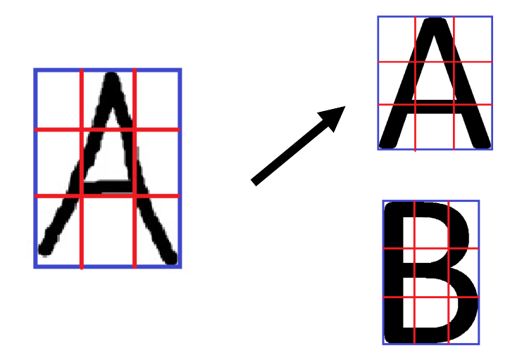

# Basic OCR
Very basic OCR (= optical character recognition). The script takes images containing one capital letter of the english alphabet and tries to answer what character it is.

How it works:
1. Generates images of the english alphabet (in Data/Alphabet) and analyzes them (explained in 3.-5.) - they serve as a reference source of images
2. Loads sentence (images of letters; from Data/Sentence by default)
3. Crops the images - shrinks the edges of the image so that the letter is touching the edges (there has to be not a single one random dark pixel in the background)
4. Splits the images - every image is splitted into 4x4 smaller subimages
5. Analyzes the images - the proportion of black/white pixels in each subimage is calculated
6. Compares the sentence to the reference letters - proportions of images are compared to the reference letters and the most fitting letter is chosen

Tested on ComicSans font with 80% accuracy and on letters drawn by me (in Data/Draw) with 88% accuracy
